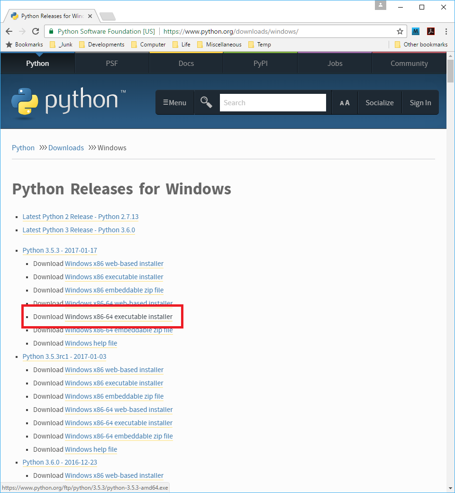

# インストール

本章では、深層学習のライブラリの1つであるGoogleの[TensorFlow](https://www.tensorflow.org/)と、TensorFlowの実行に必要な[Python](https://www.python.jp)をインストールします。

インストール先となるOSは、シェアが最も高いWindowsとしましょう。

## Pythonのインストール

まずは、プログラミング言語のPythonをインストールします。科学技術コンピューティングといえばPythonですもんね。

### Pythonのバージョンは、3.x系で

Pythonには2.x系と3.x系という互換性がない2つのバージョンがあって、だからどちらにしようか迷うことが多いようですけど、本稿では3.x系を選択します。

3.x系の良いところは、2.x系との互換性を捨て去ることで得た一貫性のある分かりやすい言語仕様です。そして悪いところは、世の中には2.x系にしか対応していないライブラリがあって、それらが使えないこと……なのですけど、本稿が使用するTensorFlowは、Windows環境では3.xにしか対応していないというまさかの逆パターンなんですよ。というわけで、無条件で3.xとなります。

### Python 3.5.3のインストール

Webブラウザーで[https://www.python.org/](https://www.python.org/)を開き、一番下までスクロールして、Downloadsの[Windows]リンクをクリックしてください。


2017年3月現在のTensorFlow（バージョンは1.0）は、Windows環境ではPythonの3.5.xしかサポートしませんから、3.5.xの中で最新の[Python 3.5.3 - 2017-01-17]の下の[Windows x86-64 executable installer]をクリックして、ダウンロードしました。



ダウンロードした「python-3.5.3-amd64.exe」を実行して、[Install Now]をクリックしてください。


以下のウィンドウが表示されたら、インストールは完了です。


### venvで、TensorFlow用の仮想環境を作る

実は素のPythonだけでできることは少なくて、だから多数のライブラリを追加してできることを増やしていきます。TensorFlowだって、そのライブラリの一つですもんね。

でも、多数のライブラリをインストールすると、ライブラリ間で競合が発生してしまうかもしれません。そもそも、Pythonのバージョンだって複数必要になるかもしれませんし（もしTensorFlowを使わないなら、最新のPythonの3.6.xを使ってみたいでしょ？）。この問題を避けるには、適当な単位（プロジェクト単位等）で仮想環境を作ってあげればオッケー。Pythonの3.x系には仮想環境を作るための`venv`というツールが付属していますから、これを使用しましょう。

というわけで、コマンドプロンプトを起動して適当なディレクトリ（Documents等）に移動し、以下のコマンドを実行してください。

```bash
> %HOMEDRIVE%%HOMEPATH%\AppData\Local\Programs\Python\Python35\python -m venv TensorFlow
```

上のコマンドを実行すると、TensorFlowというディレクトリが作成されます。このディレクトリが、Pythonの仮想環境です。

仮想環境をアクティブにするときは、作成したTensorFlowディレクトリに移動して`scripts\activate`を実行してください。

```bash
> cd TensorFlow
> scripts\activate
```

仮想環境がアクティブになると、プロンプトが`(TensorFlow) >`のように変わります。仮想環境がアクティブになれば、先ほどのように長いパスを入力しなくても、ただ`python`と入力するだけでPythonのインタープリターが起動します。


起動したPythonのインタープリターを終了したい場合は、`exit()`と入力してください。

## TensorFlowのインストール

深層学習のライブラリとしては、2017年3月現在ならTensorFlowかChainerのどちらかを選んでおけば間違いなく幸せになれます。本稿では、筆者の独断でTensorFlowを使用します。強いて理由を挙げるなら、Google製なので寄らば大樹みたいな安心感があるところかなぁ[^2]。

### pip

ライブラリのWebサイトを開いてインストール・プログラムをダウンロードしてインストール、そのライブラリが依存するライブラリについても漏れ無く同様の手順を実行しておいてね……という大昔のJavaみたいな環境構築作業はやってられないので、今時の言語にはたいていライブラリを管理するシステムが付属しています（Rubyならgem、Haskellならcabal）。で、Pythonの場合は、`pip`というコマンドでライブラリを管理するのが一般的です。TensorFlowも、この`pip`で簡単にインストールできます。

というわけで、Pythonのインストール時に作成した仮想環境をアクティブ化して、以下のコマンドを実行しましょう[^3]。

```bash
(TensorFlow) > pip install tensorflow
```

これだけで、TensorFlowの実行に必要なNumPyなどの他のライブラリも含めた全てが、一括でインストールされます。


これで終了。正しくインストールされたか、確認してみましょう。TensorFlowを使用して、`1 + 1`を計算してみます。


はい、`1 + 1`の計算結果である`2`が表示されました。深層学習する準備は、これで完璧ですね。

[^2]: 本稿の後半で紹介するTensorFlowの機能面でのメリットとして、自動微分があります。TensorFlowなら、計算グラフを作るだけで、学習に必要となる微分のコードを書かなくてもよいんですよ。私のような数学大嫌いな微分なにそれおいしいのという人間でも、最新の深層学習の計算グラフをただただ書き写せば動いてしまうというわけ。まぁ、Chainerでも、深層学習で一般的に使われる演算についてはライブラリ中に微分のコードが実装されていますから、通常は微分のことなんか考えなくて済みますけど。

[^3]: nVidiaのCUDAに対応したGPUを積んだコンピューターでCUDAとcuDNNがセットアップされている場合は、`pip install tensorflow-gpu`でGPUを使用して高速に動作するバージョンのTensorFlowをセットアップできます。GPU版を使用しても、本稿のコードは全て動作しますのでご安心を（Ubuntu 16.04 ＋ GeForce GTX 980 Tiで動作確認済み）。
