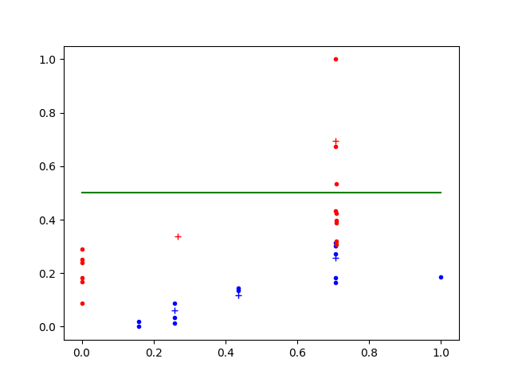
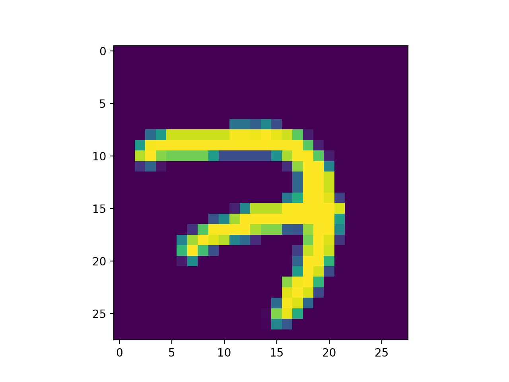
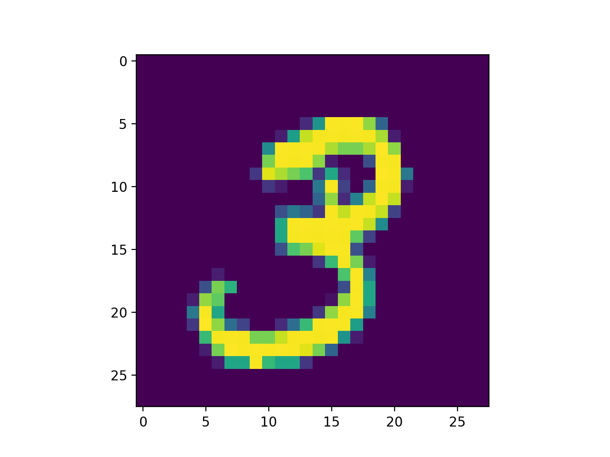
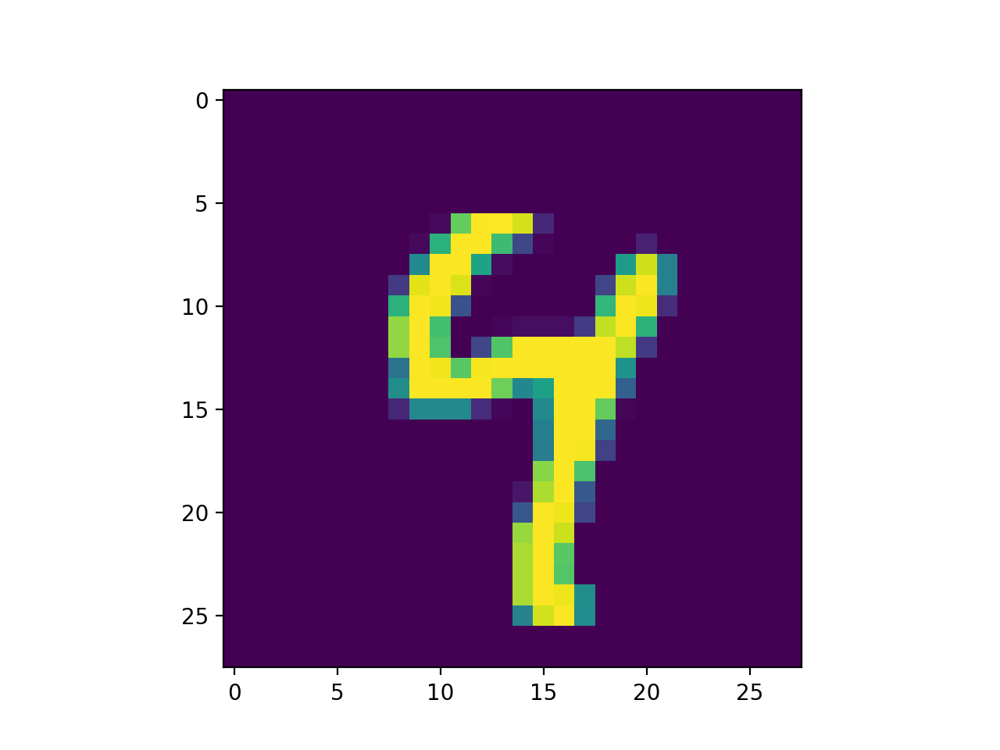
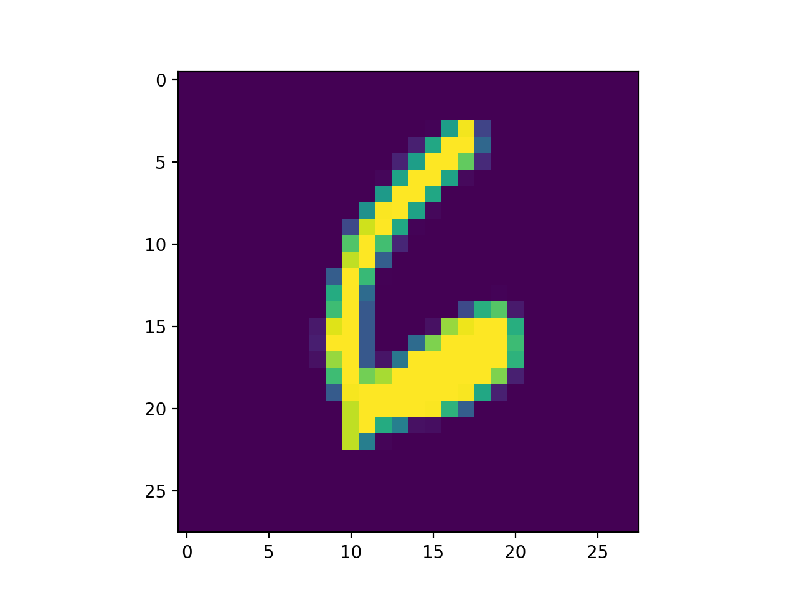
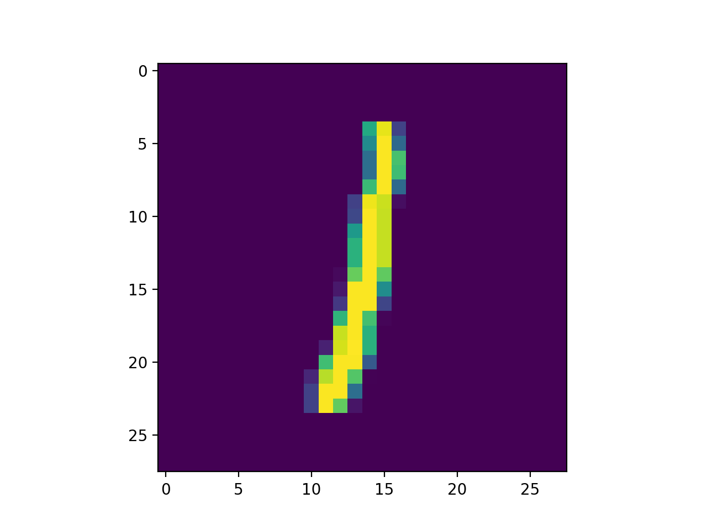

# 深層学習とは？

TensorFlowの環境ができたから、さっそくプログラミング……の前に、深層学習とはどんなものなのか、その概要を勉強することにしましょう。理解していた方が、深層学習をより良く使えますもんね。

## 形式ニューロン

まずは、基礎から。深層学習はニューラル・ネットワークを学習させるテクニックなのですが、そのニューラル・ネットワークを構成する要素であるニューロンの話から始めさせてください。

生物のニューロンは、その細胞体から何本も生えた樹状突起で刺激を受け取って、なんだかよくわからない基準でいい感じに刺激群を判断して、軸索を通じて次のニューロンに刺激を送ったり送らなかったりします。こんなので、我々の脳は構成されているみたい。

＊＊＊絵＊＊＊

で、このニューロンの「なんだかよくわからない基準でいい感じ」の部分を、はるか昔の1943年にマッカロックさんとピッツさんが形式ニューロンとしてソフトウェア化してくれました。図にすると、以下のような感じ。

＊＊＊絵＊＊＊

Pythonのコードにすると、以下のような感じ。

```python
weights = (4, 2, 2)  # 重み
threshold = 3  # しきい値


def formal_neuron(*xs):  # xsは3つの真偽値
    # 真である場合の重みを足しあわせて、しきい値を超えたら真。そうでなければ偽。
    return sum(weights[i] for i, x in enumerate(xs) if x) > threshold
```

この形式ニューロン、こんな単純な構造のくせに、なかなかいい感じに判断してくれます。

具体的にいきましょう。先ほどのコードの`formal_neuron`に、私が今週末に遊びに行くかどうかを表現させてみます。引数である`xs`を構成する3つの真偽値は、それぞれ「晴れている」、「読むべき本がない」、「やらなければならない仕事がない」とします（否定形でわかりづらくてごめんなさい。マイナスの数字を使うのは難しかったの……）。

私の趣味はオートバイで、しかも独身で家族いなくてコミュ症で友達いません。だから、晴れていれば（他の条件がどうであっても）オートバイでツーリングに行きます。確認してみましょう。

```python
>>> formal_neuron(True, False, False)  # 晴れ、本あり、仕事あり。
True  # 遊びに行く
>>>
```

私は、読むべき有益な本があっても仕事が残っていても、晴れていればオートバイで出かけちゃうる阿呆だということがわかりました。なんか、光に反応する昆虫みたいですな。

でも、雨が降ったらどうなるのでしょうか？　続けて試してみましょう。

```python
>>> formal_neuron(False, True, False)  # 雨、本なし、仕事あり。
False  # 遊びに行かない。
>>> formal_neuron(False, False, True)  # 雨、本あり、仕事なし。
False  # 遊びに行かない。
>>> formal_neuron(False, True, True)   # 雨、本なし、仕事なし。
True   # 遊びに行く。
>>> 
```

なるほど、まだ読んでいない本があるならそれを読む、仕事があるなら仕事をする、どちらもないなら、雨であってもカッパを着てオートバイに乗るわけですね。こんな単純なコードなのに、いい感じに判断できていて面白いでしょ？

でも、もっと面白いことがあるんです。重みである`weights`としきい値である`threshold`を調整するだけで、私とは異なる人の場合も表現できるんです。たとえば、しきい値を`4`にすれば（`threshold = 4`）、晴れていれば遊びに行くけど雨ならば遊びに行かないという、雨が嫌いなオートバイ大好き人間になります。晴れの重みを減らして本の重みを増やしたなら（`weights = [2, 4, 2]`）、ビブリオマニアの読子＝リードマンさんですね。

その他、ANDとOR、NOTなんてのも表現できます。形式ニューロンを多段に組み合わせて良いのであれば、XORも表現できます。

```python
from itertools import chain


def and_(*xs):
    # weightsとthresholdは、関数内に埋め込んでいます。
    return sum((1, 1)[i] for i, x in enumerate(xs) if x) > 1.5


def or_(*xs):
    return sum((1, 1)[i] for i, x in enumerate(xs) if x) > 0.5


def not_(*xs):
    return sum((-1,)[i] for i, x in enumerate(xs) if x) > -0.5


def xor_(*xs):
    def next_layer(*next_xs):
        return sum((1, 1, -2)[i] for i, x in enumerate(next_xs) if x) > 0.5

    return next_layer(*chain(xs, ((sum((1, 1)[i] for i, x in enumerate(xs) if x) > 1.5),)))
```

スゲー。ANDとORとNOTとXORを表現できるってことは、つまり、どんな電子回路でも作れるってことです。CPUを作れちゃうってことなんですよ。

これなら、もっとスゴイこともできそうです。適切な重みとしきい値を持った形式ニューロンをいい感じに積み重ねていけば、生物の脳と同様の判断、たとえば網膜に映った画像から餌の有無を判断できるかもしれません。だって、形式ニューロンは生物のニューロンを模しているんですから！

## 単純パーセプトロン

……ごめんなさい。そうは問屋が卸してくれませんでした。だって、パラメーター設定が難しすぎますもん。前節のXORのコードを書けたのは、Wikipediaの形式ニューロンの説明の中にパラメーターが載っていたからで、私が頑張ってパラメーターを設定したからではありません。XOR程度でこれなのですから、画像認識のためのパラメーター調整なんてのは、人間がやれる作業じゃあないですよ。

では、どうするか？　人間ができないなら、機械にやらせてしまえばよいわけです。そのために、1957年にローゼンブラットさんがパーセプトロンを発明しました。

パーセプトロンをコードにすると、以下のようになります。形式ニューロンとの違いは、入力値の要素と重みの要素を掛け算するようになったのと、しきい値（`threshold`）がバイアス（`bias`）と改名されて比較演算子の左に移動した程度。あと、掛け算をするので、入力値は実数になるところ。なお、機械学習するんだからパラメーター調整は私がやらなくても良いので、重みもバイアスもとりあえず適当な値にしてあります。

```python
weights = (0.0, 1.0)  # 重み
bias = -0.5  # バイアス


def perceptron(*xs):
    return 1 if sum(x * weight for x, weight in zip(xs, weights)) + bias >= 0 else 0
```

パーセプトロンの良い所は、重みやバイアスを調整しやすいところです。

形式ニューロンだと、判断に間違えた時に、重みやバイアスをどの程度変更したらよいのかが分からなかいですよね。でも、パーセプトロンなら、`x * weights`になっていますから、`x`に関係した数値で`weight`を増減させてあげればよさそう。`bias`については、`x`が1だとみなしちゃえばよいでしょう。

というわけで、このパーセプトロンを機械学習させます。今回は、男の子ならみんな大好きスーパー・カーのオートバイ版であるスーパー・スポーツ（とにかく速くて馬鹿っぽいオートバイだと思ってください）の判別とします。上のコードでは重みが2個なので`xs`の数は2つ、オートバイを表現する数値2つということで、エンジンの大きさ（排気量）と価格を入力にします。

さっそく、日本のバイクメーカーであるホンダとヤマハとカワサキとスズキのスーパー・スポーツなオートバイのデータを集めてきました。判断のためにはスーパー・スポーツでは「ない」オートバイも必要ですから、2016年の販売台数トップ10（400cc以上）の中から国産のオートバイを抜き出したものも付け加えます。あと、もちろん機械学習して学習結果を検証するコードが必要で、パーセプトロンの機械学習がどのように進むのかを可視化するコードもあったほうがよいでしょう。

というわけで、以下のコードを作りました（長くてごめんなさい。TensorFlowを使いだせば、抽象化レベルが高くなってコードが短くなりますのでご安心を）。

```python
import matplotlib.pyplot as plot  # 動かす前に、pip install matplotlibしておいてください。
import matplotlib.animation as animation

from itertools import starmap
from random import shuffle


weights = (0.0, 1.0)  # 重み
bias = -0.5  # バイアス


# パーセプトロン。
def perceptron(*xs):
    # 入力と重みを掛け算して足しあわせてバイアスを足した結果が0以上なら1、そうでなければ0を返します。
    return 1 if sum(x * weight for x, weight in zip(xs, weights)) + bias >= 0 else 0


# 機械学習用のデータ。
motorcycles = (
    # ひとつ目の要素が1なら、スーパー・スポーツ。ふたつ目の要素は、排気量と価格のタプル。
    (1, ( 999, 1501200)),  # ホンダ CBR1000RR（ロスホワイト）
    (1, ( 999, 1468800)),  # ホンダ CBR1000RR
    (1, ( 999, 1674000)),  # ホンダ CBR1000RR<ABS>（ロスホワイト）
    (1, ( 999, 2030400)),  # ホンダ CBR1000RR SP
    (1, ( 599, 1334880)),  # ホンダ CBR600RR<ABS>（ロスホワイト）
    (1, ( 599, 1162080)),  # ホンダ CBR600RR（ロスホワイト）
    (1, ( 599, 1302480)),  # ホンダ CBR600RR<ABS>（グラファイトブラック）
    (1, ( 599, 1129680)),  # ホンダ CBR600RR（グラファイトブラック）
    (1, ( 998, 2430000)),  # ヤマハ YZF-R1（ライトれディッシュイエローソリット1）
    (1, ( 998, 2376000)),  # ヤマハ YZF-R1（ディープパープリッシュブルーメタリックC）
    (1, ( 998, 3186000)),  # ヤマハ YZF-R1M
    (1, ( 998, 1782000)),  # カワサキ Ninja ZX-10R
    (1, ( 599,  924480)),  # カワサキ Ninja ZX-6R
    (1, ( 999, 1695600)),  # スズキ GSX-R1000
    (1, ( 999, 1760400)),  # スズキ GSX-R1000 ABS
    (1, ( 750, 1544400)),  # スズキ GSX-R750
    (1, ( 599, 1425600)),  # スズキ GSX-R600

    # ひとつ目の要素が0なら、スーパースポーツではない。
    (0, ( 845, 1069200)),  # ヤマハ MT-09 TRACER ABS
    (0, ( 745,  743040)),  # ホンダ NC750X
    (0, ( 745,  793800)),  # ホンダ NC750X<ABS>
    (0, ( 745,  859680)),  # ホンダ NC750X DCS<ABS>
    (0, ( 745,  924480)),  # ホンダ NC750X DCS<ABS> E Package
    (0, ( 845, 1004400)),  # ヤマハ MT-09 ABS
    (0, ( 998, 1382400)),  # ホンダ CRF1000L（ヴィクトリーレッド、パールグレアホワイト）
    (0, ( 998, 1350000)),  # ホンダ CRF1000L（キャンディープロミネンスレッド、デジタルシルバーメタリック）
    (0, ( 998, 1490400)),  # ホンダ CRF1000L DCS（ヴィクトリーレッド、パールグレアホワイト）
    (0, ( 998, 1458000)),  # ホンダ CRF1000L DCS（キャンディープロミネンスレッド、デジタルシルバーメタリック）
    (0, ( 998, 1115640)),  # スズキ GSX-S1000 ABS
    (0, ( 998, 1166400)),  # スズキ GSX-S1000F ABS
    (0, ( 688,  760320)),  # ヤマハ MT-07 ABS
    (0, ( 688,  710640)),  # ヤマハ MT-07
    (0, ( 845, 1042200)),  # ヤマハ XSR900
    (0, (1164, 1172880)))  # カワサキ ZRX1200 DAEG


# 機械学習します。
def train():
    global weights, bias

    # 排気量と価格を、0〜1の間の数値に正規化します。
    min_xs = tuple(min(starmap(lambda _, xs: xs[i], motorcycles)) for i in range(2))
    max_xs = tuple(max(starmap(lambda _, xs: xs[i], motorcycles)) for i in range(2))
    normalized_motorcycles = [(label, tuple((xs[i] - min_xs[i]) / (max_xs[i] - min_xs[i]) for i in range(2))) for label, xs in motorcycles]

    # 検証用データ（test_data）と学習用データ（train_data）に分けます。
    shuffle(normalized_motorcycles)
    test_data, train_data = normalized_motorcycles[:5], normalized_motorcycles[5:]

    # 学習率（詳細は本文を参照してください）。
    learning_rate = 0.01

    # Matplotlibを使用して、可視化します。
    # アニメーション用の変数。
    figure = plot.figure()
    images = []
    
    # データを散布図として描画します。
    plot.plot([xs[0] for label, xs in train_data if label == 0],
              [xs[1] for label, xs in train_data if label == 0],
              'bo',
              marker='.')
    plot.plot([xs[0] for label, xs in train_data if label == 1],
              [xs[1] for label, xs in train_data if label == 1],
              'ro',
              marker='.')
    plot.plot([xs[0] for label, xs in test_data if label == 0],
              [xs[1] for label, xs in test_data if label == 0],
              'bo',
              marker='+')
    plot.plot([xs[0] for label, xs in test_data if label == 1],
              [xs[1] for label, xs in test_data if label == 1],
              'ro',
              marker='+')

    # 学習。
    for i in range(100):
        images.append(plot.plot([-(weights[0] / weights[1]) * i - (bias / weights[1]) for i in range(2)], 'g'))

        for label, xs in train_data:
            result = perceptron(*xs)
            if (result != label):
                weights = tuple(weights[i] + learning_rate * (label - result) * xs[i] for i in range(2))
                bias = bias + learning_rate * (label - result)

    # 検証。
    for label, xs in test_data:
        print("{0}: {1}".format(label, perceptron(*xs)))

    # 学習過程のアニメーションを表示します。
    artist_animation = animation.ArtistAnimation(figure, images, interval=1, repeat_delay=1000)
    # artist_animation.save('perceptron.gif', writer='imagemagick')
    plot.show()


if __name__ == '__main__':
    train()
```

上のコードの中で機械学習部分のコードは、以下になります。

```python
for label, xs in train_data:
    result = perceptron(*xs)

    # もし答えを間違えたら、重みとバイアスを調整します。
    if (result != label):
        weights = tuple(weights[i] + learning_rate * (label - result) * xs[i] for i in range(2))
        bias = bias + learning_rate * (label - result)
```

重みの要素（`weights[i]`）を、対応する入力の要素（`xs[i]`）で増減（正解が`1`で答えが`0`なら`1 - 0 = 1`を掛けているので増、逆なら`0 - 1 = -1`を掛けるので減）させています。で、対応する入力の要素そのままだと重みやバイアスが大きく変わりすぎてしまいますので、学習率（`learning_rate`）に設定した適切な値（今回は`0.01`。適当に決めました）を掛け算しています。あと、データ数が少ないので、上の学習を100回繰り返しています。

こんな単純な処理ですけど、パーセプトロンはなんだかうまいこと機械学習してくれます。プログラムを実行すると、最終的に以下の検証コード

```python
for label, xs in test_data:
    # 「<正解データ>: <パーセプトロンの解答>」を表示します。
    print("{0}: {1}".format(label, perceptron(*xs)))
```

が実行されて、コンソールに以下のような内容が表示されます。

```shell
0: 0
0: 0
1: 1
1: 1
0: 0
```

コロンの左が正解（スーパー・スポーツなら1、そうでなければ0）で、右がパーセプトロンが出した解答ですから、ほら、全問正解です（検証データの選択はランダムなので違う結果になることもありますけど、概ね正解できるはず）。

続いて、別ウィンドウが開いて以下の画像のようなアニメーションが表示されます。



X軸を排気量、Y軸を価格に（0〜1の数値になるように正規化しています）、スーパー・スポーツを赤、そうでない場合を青で描画しています。で、このウネウネと動いている緑の直線が、重みとバイアスを使用した判断の境目になります。

……えっと、「なんだかすごくない」とお感じになった皆様、皆様の感覚は正しいです。単純なパーセプトロンだと、データを直線で区切ることしかできないんですよ（重みや入力が3つの場合は、3次元空間上の2次元平面、4つの場合は4次元空間上の3次元の直線っぽい何かで二分します）。今回うまく学習できたのは、たまたまデータがパーセプトロンで判別できるものだったからに過ぎません。スーパー・スポーツのような高性能なオートバイは排気量あたりの価格が高い（あと、ボッタクリ価格の外車がデータに入っていない）から、直線で分別できただけなんですよ。

たとえば、体重と身長から長生きするかを判断する（身長が低い方が長生きする傾向にあるので直線で区切れそうに思えますけど、痩せすぎも太りすぎも長生きしそうにないので直線では区切れません）ような場合は、単純なパーセプトロンではダメです。複雑な判断が必要な多くの場合では、この単純なパーセプトロンは使用できないんですよ。

＊＊＊身長と体重と長生きの図＊＊＊

## 多層パーセプトロン（の理論）

だったら、パーセプトロンを組み合わせればよいのでは？　具体的には、以下の図のように積み重ねちゃえばよいのでは？

＊＊＊パーセプトロンを積み重ねた図＊＊＊

それはもちろんその通りなのですけど、ただ積み重ねるだけだと、単純なパーセプトロンの出力は0か1のどちらかであるという点が問題となります。重みやバイアスを調整しても出力が0のまま変わらなかったり、ほんの少し調整したら出力が0からいきなり1に変わったりするわけですから、この出力を受け取る次の層のパーセプトロンはとても混乱してしまい、学習が不可能になります。そもそも、パーセプトロンへの入力は実数なのですから、パーセプトロンからの出力が0または1だったら積み重ねようがありませんしね。

というわけで、パーセプトロンの出力を実数にしてみます。以下のような感じでしょうか？

```python
def perceptron(*xs):
    return sum(x * weight for x, weight in zip(xs, weights)) + bias
```

残念！　これだけではまだダメです。これだけだと、層を増やしても能力が上がらないらしいんですよ（私の数学力では、理由は全く分からなかったけど）。どこかに非線形な要素を追加しないとダメなんだってさ。

だから、「いきなり変わるのではなくてなだらかに変わる（そうじゃないと、学習できない）」かつ「非線形（そうじゃないと、複雑な分類ができない）」な、活性化関数と呼ばれる関数でくるんであげましょう。で、大昔からある活性化関数にシグモイド関数というのがあって、その出力は以下のような形をしています。

＊＊＊シグモイド関数の図＊＊＊

うん、なだらかかつ非線形ですな。ギャップがなくて直線じゃあないですもん。

あと、活性化関数にはもう一つ特徴が必要で、それは「微分できる」ことなんです。重みやバイアスをどの程度変えたらどのように出力が変わるのかが微分で分かるみたいで、そうすれば積み重ねたニューロンを、前の層へ、出力から入力へと逆に調整していくことが可能になるんです。このような、微分をうまいこと使って誤差を逆向きに伝播させて学習させる方式を、逆誤差伝播学習法（バックプロパゲーション）と呼びます。

このような、出力を実数にして活性化関数を間に挟んで、逆誤差伝播学習法に類する方法で複数層のニューロンを学習させるという方式が、1960年代という大昔に発明されました。ただ、当時のコンピューターは貧弱すぎて、逆誤差伝播学習法はまともに動かなかったみたい。使えないものだからみんなすぐに忘れ、また誰かが再発明してまたみんなに忘れられ……という可哀想な運命を辿った挙句、1986年にラメルハートさんとその仲間たちが逆誤差伝播学習法と名づけたあたりで、コンピューターの性能が追いついてやっと定着したみたい。

TODO: 以下の勾配消失の説明を修正すること！　掛け算の問題みたい。

ただ、先程紹介したシグモイド関数って、端の方にいくと変化が小さくなってしまうんですよ。変化が小さいということは微分した結果も小さくなるということで、伝播が少ないので学習が進みづらくなってしまいます。この問題を、勾配消失問題と呼びます。だから、今ではシグモイド関数はあまり使われていなくて、ReLUという以下の図のような特徴を持つ活性化関数が流行っています。

＊＊＊ReLUの図＊＊＊

この図は、先程のシグモイド関数の場合とは全然似ていませんけど、でも、これでも活性化関数として使えるんです。線はつながっているので、まぁなだらかと言えます。0のところで曲がっていますから、線形ではありません。0のところは数学的には微分できませんけど、0か1のどちらかに決め打っちゃえば大丈夫です（劣微分と言います）。ほら、なんとかなりました！　0以下は変化が無いので学習が止まっちゃいそうですけど、0以上ならばどこまでいっても一定の比率で学習が進みそうです。

実際、ReLUはとても優れた活性化関数です。勾配消失が発生しづらいですから、ニューロンを多段に重ね合わせることができます。単純なので、速く計算できます。あと、何といってもコードが簡単です。だから、活性化関数としてReLUを組み込んだパーセプトロンのコードは、私でもすぐ紹介できます。

```python
def perceptron(*xs):
    return max(0, sum(x * weight for x, weight in zip(xs, weights)) + bias)
```

えっと、`max(0, ...)`を追加しただけですな。

これで、逆誤差伝播学習法で学習させられる「多層パーセプトロン」が完成しました（対比のために、前節で述べたパーセプトロンは「単純パーセプトロン」と呼ばれます）。

実は、深層学習は、この多層パーセプロトンを逆誤差伝播学習法で学習させるところから始まっています（当時はReLUはなかったけどね）。で、逆誤差伝播学習法が発表された1986年というのは、ファミリー・コンピューター用のドラゴンクエストIが発売された年なんです。2017年にPlay Station 4でファイナル・ファンタジーXVをやっている我々から見たら、旧世代のカンタンな技術ですよ。

## 多層パーセプトロン（の実装）

でも、逆誤差伝播学習法で深層学習するには、微分をしなければなりません……。みなさんはどうか分かりませんけど、私は絶対に微分したくない。そもそも、私立文系の私は微分できないし！　というわけで、ついにTensorFlowを使います。TensorFlowは自動微分の機能を持っているので、私のような数学が全くできない人間でも深層学習できるんですよ[^4]。

### MNIST

お題は、手書き文字認識としましょう。MNISTという、28×28ドットの手書き数字のデータ・セットを使用します。MNISTは、トレーニング用データを6万個、テスト用データを1万個もっています。

TensorFlowは、このMNISTをインターネットからダウンロードしてPythonで扱えるように変換してくれるクラスを含んでいますので、今回はそれを使って少しだけ楽をします。

```python
import matplotlib.pyplot as plot  # 動かす前に、pip install matplotlibしておいてください。
import numpy as np

from tensorflow.examples.tutorials.mnist import input_data

# MNISTデータ・セットを読み込みます。
train_data_set, validation_data_set, test_data_set = input_data.read_data_sets("MNIST_data/")

# データは、imagesとlabelsで取得できます。
print(len(train_data_set.images))
print(len(train_data_set.labels))

# next_batch()で、指定した数のデータを取り出せます。
images, labels = train_data_set.next_batch(5)

# 画像は、728個の実数のリスト。
print(images)

# ラベルは0から9の数値。
print(labels)

# 可視化してみます。
for image in images:
    plot.imshow(np.reshape(image, (28, 28)))
    plot.show()
```

実際にデータを読み込む部分は、以下の1行だけです。簡単ですな。

```python
train_data_set, validation_data_set, test_data_set = input_data.read_data_sets("MNIST_data/")
```

`read_data_sets()`は、その内部で学習用と検証用、テスト用の3つのデータ・セットを生成します。MNISTそのものは学習用とテスト用の2つにしか分けていないのですけど、TensorFlowのMNIST関連ライブラリは、学習用データの一部を検証用データに分割してくれます（データ分割については、あとで）。

学習用と検証用、テスト用のデータ・セットは、`images`と`labels`という属性を持ちます。`images`は画像のリストで、画像は0.0〜1.0のデータを784個（28ドット×28ドット=784ドット）含むリスト形式になります。`labels`は正解データのリストで、正解データは0〜9の数値です。

上のコードの最後の部分のようにMatplotlibとNumPyを使用して画像を可視化すると、以下のようになります。

{width=128 height=96}{width=128 height=96}{width=128 height=96}{width=128 height=96}{width=128 height=96}

これらの画像がなんの数字なのかは、先に述べた`labels`を表示してみれば分かります。`print`してみたら、7、3、4、6、1でした。

### 計算グラフ

先程実施した単純パーセプトロンの学習のときと同様で、学習というのは重みやバイアスといった変数の値を調整する作業になります[^5]。で、変数を調整するための元ネタとして、単純パーセプトロンでは入力値を、今からやろうとしている逆誤差伝播学習法では微分を使うんでした。

この微分には、どのような計算がなされたのかという情報が必要なんだそうです。そういえば、はるか昔、私が高校時代にぶん投げた数学の教科書には「f(x,y)=*小難しい式*のとき、xで偏微分せよ」とか書いてあったような気がします。「どんな式かは分からないけど、フィーリングでいい感じで偏微分してちょうだいよ」というわけにはいかないみたい。

だから、TensorFlowには計算式を定義する機能があります。別に難しくはなくて、TensorFlowが提供する演算子や関数と、変数作成機能を使って普通にプログラミングしていくだけ。具体的に、足し算を例に試してみましょう。

```python
import tensorflow as tf

a = tf.Variable(1)
b = tf.Variable(2)
c = a + b
d = tf.Variable(3)
e = c + d

print(e)
print(e.op)
```

`tf.Variable`は、TensorFlowで定義する計算式中で使用できる変数を表現するクラスです。TensorFlowの変数を使うと、`+`は通常のPythonの`+`ではなく、`tf.add()`に置き換えられます。で、変数`c`には、「計算結果」ではなくて「計算式」が代入されます。だから、`print(c)`しても`3`は表示されず、`Tensor("add_12:0", shape=(), dtype=int32)`のような変な文字列が表示されます。あと、`print(c.op)`してみると（`op`はOperationの`op`）、以下のような面白い内容が出力されます。

```python
name: "add_12"
op: "Add"
input: "add_11"
input: "Variable_19/read"
attr {
  key: "T"
  value {
    type: DT_INT32
  }
}
```

うん、どのような計算をするのかを表現していますな。面白いのは、一つ目の`input`の値です。他の計算式（変数`c`が指し示す計算式）を指しています。計算式を、グラフ形式で表現しているわけ。このような計算を表現するグラフを、計算グラフと呼びます。

で、ここまでで定義した計算グラフを実行するには、TensorFlowのセッションが必要です。こんな感じ。

```python
# セッションを作成します。
with tf.Session() as session:
    # TensorFlowのVariableは、明示的に初期化しなければなりません。
    session.run(tf.global_variables_initializer())
    
    # 計算グラフを実行します。
    result = session.run(e)
    
    # 計算結果を表示します。
    print(result)
```

ここまでやって、やっと計算の実行結果である`6`が表示されます……。

2段階に分かれているので面倒に感じますけど、単純パーセプトロンのときみたいに学習のためのロジックを手書きするより遥かに簡単なので、我慢してください。そもそも、上の例のような順方向の計算だけなら、TensorFlowを使わずに普通に組めばよいわけですしね。

### テンソル

ところで、先程計算グラフを`print()`した時に表示された「Tensor」って何なのでしょうか？　Wikipediaで調べてみると「線形的な量または線形的な幾何概念を一般化したもので、基底を選べば、多次元の配列として表現できるようなもの」と書いてあるけど、私にはなんだそれって感じ……。

まぁ、プログラミングのレベルでぶっちゃけていえば、テンソルってのは固定長の多次元の配列にすぎません。値そのものを表すスカラー（1や2.0）とかベクトル（平面座標`[x, y]`や立体座標`[x, y, z]`）とか行列（3次元グラフィックスの座標変換で使うアレ）とかを統一的に扱う仕組みですな。スカラーはランク0、ベクトルはランク1、行列はランク2のテンソルと表現されます。カラー画像の場合だと、そのランクは3になります。X座標、Y座標、色（RGBA）と3つ指定してはじめて、その明るさが分かるわけですからね。普段プログラミングでやっている内容ですから、別に身構えなくても大丈夫です。

で、なんでこのテンソルが深層学習で重要かというと、多層パーセプトロンをテンソルの演算として表現できるんですよ。単純パーセプトロンのとこでやった`sum(x * weight for x, weight in zip(xs, weights)`は、xsというテンソル（この場合はランク1なのでベクトル）とweightsというテンソル（同様にベクトル）に対するドット積（もしくは内積）と呼ばれる演算に相当します。だから、NumPyを使うなら上のコードは`np.dot(xs, weights)`とか`np.inner(xs, weights)`とか`np.matmul(xs, weights)`とかのように、とても簡単に書けます。

パーセプトロンを複数個並べる場合だって、とても簡単です。たとえばパーセプトロンが2個なら、以下のような感じ。

```python
x = np.array([1, 2])  # テンソルを中心に置くプログラミングでは、変数は複数形にしません。
w = np.array([[3, 4], [5, 6]])
b = np.array([7, 8])

print(np.maximum(np.matmul(x, w) + b, 0))  # [20 24]が表示されます。
```

xとbのランクを1つ上げて、最初の添字の要素数を2にするだけ。プログラマーにとってはパーセプトロンのインスタンスを複数個作成してリストに格納して`for`文等でそれぞれを呼び出すというやり方が馴染み深いですけれど、こんなやり方もあるんですな。

ともあれ、このやり方なら、多層パーセプトロンの全てを計算式、つまりは計算グラフとして表現できることになります[^6]。計算式が分かれば逆誤差伝播学習法が使えるわけで、これならもうすぐに深層学習できちゃう。

### tf.contrib.layersとtf.nn、tf.train、tf

というわけで、機械学習可能な多層パーセプトロンをテンソルを使用する計算グラフとして定義……するのは、式がやたらと長くなるのでとても面倒くさいんです。だから、TensorFlowは深層学習の計算グラフを定義するための便利機能を提供しています。

まずは、`tf.contrib.layers`。`tf.contrib.layers`は、ニューラル・ネットワーク（多層パーセプトロンは、ニューラル・ネットワークの一つ）の層を生成する機能を提供します。たとえば、`tf.contrib.layers`の中の`fully_connected()`という関数は、多層パーセプトロンの層を一つ、まるっと作成してれます（どうしてこんな変な名前になっているかというと、後述する畳み込み層との対比で全結合層と呼ばれるようになったため……。深層学習とか数学は、歴史が長いので命名がバラバラで涙が出ちゃう）。`linear()`は、活性化関数を含まない`fully_connected()`です。一番最後の層、出口で使います。

`tf.nn`は、ニューラル・ネットワーク特有の処理を提供します。たとえば、少し前で述べたReLUが`relu()`関数として定義されています（`tf.contrib.layers.fully_connected()`等が勝手にReLUしてくれるので、直接使う場合は少ないですけど）。逆誤差伝播学習法での伝播していく大本の誤差はクロス・エントロピーと呼ばれる計算で出すとよいとされているのですど、そのクロス・エントロピーを計算してくれる`sparse_softmax_cross_entropy_with_logits()`なんてのもあります。あと、今回のように複数の選択肢の中のどれかを答えるような場合は、最後に「1」とか「2」と出力するのではなくて、「0かなーと思う数値は0.28」、「1だと思う数値は5.97」のように、10個の数値を出力します。そんな出力の場合に正解したかどうかを確認してくれる`in_top_k()`という関数もあります。

`tf.train`という、訓練の際に役立つパッケージもあります。単純パーセプトロンのところで学習率という単語がありましたけど、深層学習だとこの学習率の設定がやたらとシビアなんですよ。`tf.train`の中には、この学習率をいい感じで自動設定（初期値を設定してくれるだけじゃなくて、適宜変更してくれる！）しながら訓練してくれる`AdamOptimizer`というクラスがあります。

で、これらのパッケージに含まれない基礎的な機能は、`tf`パッケージが提供します。`placeholder()`という、入力値や正解ラベルなどの、学習で調整されるわけではなくて定数ではない入れ物を作る関数とか、変数の初期化のための`global_variable_initializer()`とか、平均を計算する`reduce_mean()`とかね。

### TensorFlowを使用した、多層パーセプトロン

はい、ついに必要な知識が揃いました。TensorFlowで多層パーセプトロンを作成して逆誤差伝播学習法で訓練してみましょう。

コードは、こんな感じ。

```python
import tensorflow as tf

from tensorflow.examples.tutorials.mnist import input_data

# MNISTデータを取得します。
train_data_set, validation_data_set, test_data_set = input_data.read_data_sets("MNIST_data/")

# 画像と正解ラベル、トレーニング中かをを入れる変数を作成します。
images = tf.placeholder(tf.float32, (None, 784))
labels = tf.placeholder(tf.int32, (None,))

# ニューラル・ネットワークを定義します。TensorFlowでは、ニューラル・ネットワークの出力はlogitと呼びます。
logits = tf.contrib.layers.linear(tf.contrib.layers.fully_connected(images, 128), 10)

# logitとlabelsの誤差を計算します。TensorFlowでは、lossと呼びます。
loss = tf.reduce_mean(tf.nn.sparse_softmax_cross_entropy_with_logits(labels=labels, logits=logits))

# どのように訓練するのかを定義します。lossが小さくなるように、学習率を自動で設定してくれるAdamOptimizerで訓練します。
train = tf.train.AdamOptimizer().minimize(loss)

# 正解率を計算します。
accuracy = tf.reduce_mean(tf.cast(tf.nn.in_top_k(logits, labels, 1), tf.float32))

# セッションを作成します。
with tf.Session() as session:
    # tf.contrib.layersで変数を使用しているので、初期化します。
    session.run(tf.global_variables_initializer())

    # 3000回、訓練します。
    for i in range(3000):
        # 1回の訓練では、100個のデータを使用します。
        images_value, labels_value = train_data_set.next_batch(100)
        session.run(train, feed_dict={images: images_value, labels: labels_value})

        # 精度の推移を知るために、100回に一回、訓練データと検証データでの精度を出力します。
        if i % 100 == 0:
            print("accuracy of train data: {0}".format(session.run(accuracy, feed_dict={images: images_value, labels: labels_value})))
            print("accuracy of validation data: {0}".format(session.run(accuracy, feed_dict={images: validation_data_set.images, labels: validation_data_set.labels})))

    # テスト・データでの精度を出力します。
    print("accuracy of test data: {0}".format(session.run(accuracy, feed_dict={images: test_data_set.images, labels: test_data_set.labels})))
```

MNISTのデータを取得する部分は、前に述べた通り。このデータを計算具フラフに直接入れてしまうと毎回同じ計算をすることになってしまいますから、`tf.placeholder()`を経由して接続します。`tf.placeholder()`の第一引数は要素の型（MNISTの画像のデータは0.0〜1.0なので`tf.float32`、正解ラベルは1とか2なので`tf.int32`）、第二引数は要素の数です。画像は28x28=784個になるのですけど、その前に`None`と書かれているのは、バッチ学習に対応するためです。

バッチ学習というのは、複数のデータを使用してバッチ的に学習する方式です。データ一つだけで訓練をすると、右往左往して学習が進まないんですよ。だから、複数のデータをまとめて計算して、その平均を誤差として扱うわけ。で、このバッチ学習のためにデータをまとめる数をあとから指定できるように、`None`を指定しています。

ニューラル・ネットワークの定義は、`tf.contrib.layers.fully_connected()`の結果を`tf.contrib.layers.linear()`しているだけ。TensorFlowではニューラル・ネットワークの計算グラフを`logits`という変数に格納する流儀になっている（理由は調べても分からなかった……）ので、それに従っています。

`fully_connected()`は前項で述べたように多層パーセプトロンの層の生成で、`linear()`は活性化関数を含まない多層パーセプトロンの層の生成です。引数は、入力となる計算グラフと生成したいパーセプトロンの数。ちなみに最後を`linear()`にしているのは、どのような出力にするのかを後から選べるようにするためです。どの数字かを当てるだけならそのままでよいですし、1の可能性が83.4%、2の可能性が13.2%のように表示したいなら`tf.nn.softmax()`してあげてください。今回のように逆誤差伝播学習法で学習したいなら、誤差計算のところのコードのように`tf.nn.sparse_softmax_cross_entropy_with_logits()`してあげればよいでしょう。誤差の計算では、今回はバッチ学習なので、各データの誤差を平均するために`tf.reduce_mean()`しています。

次、訓練方法。学習率を考えるのは大変なので`tf.train.AdamOptimizer`を使って全て任せることにして、誤差を最小化するように訓練するので`minimize()`を使用しています。あと、どの程度正解したかを確認するための`accuracy`という計算グラフも定義しておきます。`tf.nn.in_top_k()`は、`logit[label]`が、第三引数で指定した値の順位に収まっているかを調べます。`logits`が`[1, 2, 3]`で`label`が`2`の場合、第三引数が`1`なら`False`、第三引数が`2`なら`True`になるわけですね。で、バッチ学習なので結果は`True`や`False`のベクトルになって、Pythonの`True`は1、`False`は0として扱えるので、`tf.float32`にキャストして`tf.reduce_mean()`で平均を取って正解率としています。

以上で計算グラフの定義は完了、あとは訓練するだけ。セッションを作成して、変数を初期化して、バッチ学習用のデータを取得して、訓練用の計算グラフである`train`を実行します。`train`が参照している`loss`が参照している`logits`の計算グラフには`images`と`labels`が含まれていて、それらの値が確定しないと計算を開始できませんから、名前付き引数の`feed_dict`でバッチ学習用のデータを渡しています。

で、これで必須の作業は終わりなのですけど、訓練の結果どの程度正解したかを知りたいですよね？　だから、上のコードでは時々正解率を表示するようにしています。この正解率は、訓練データと検証データ、最後にはテスト・データの場合を表示しています。何度も似た情報を出力しているのは、訓練データに特化した学習（過学習といいます）をしてしまうのを避けるため。たとえばある問題集の解答を丸暗記すればその問題集には全問正解できるけれど、それでは他の問題集の問題は解けないので試験に落ちちゃう。訓練には使用していない検証データでも正解率も調べて、訓練データでの正解率は向上しているけど検証データでの正解率は向上しない場合は、過学習に陥ったと考えることができるわけ。検証データに加えてテスト・データでも正解率を出しているのは、ニューラル・ネットワークを調整（パーセプトロンの数を増やすとか、層を追加するとか）する際に、たまたま検証データに最適化した調整をしてしまうのを防ぐためです。検証データを使用して過学習を防いで、そのニューラル・ネットワークが本当に役に立つのかをテスト・データで検証していきます。

はい、これで解説は終わり！　プログラムを実行しましょう。少し時間がかかりますけど、最後に以下のような出力が出ます。

```python
accuracy of train data: 0.9900000095367432
accuracy of validation data: 0.9761999845504761
accuracy of test data: 0.9747999906539917
```

テスト・データでの正解率が97.5%ってのは、なかなか良い結果だと思いませんか？

## 畳み込みニューラルネットワーク

でもね、もっと正解率を向上できるんです。そう、畳み込みニューラル・ネットワークならね。

### 畳み込み？

畳み込みニューラル・ネットワークの畳み込みというのは、いったい何なのでしょうか？　例によってWikipediaで調べると「関数gを平行移動しながら関数fに重ね足し合わせる二項演算である」とあるけど、やっぱり分けわからない……。

これ、数学から考えないで、画像処理から考えると簡単に理解できます。

### TensorFlowを使用した、畳み込みニューラルネットワーク

コードは、こんな感じ。

```python
import tensorflow as tf

from tensorflow.examples.tutorials.mnist import input_data

# MNISTデータを取得します。
train_data_set, validation_data_set, test_data_set = input_data.read_data_sets("MNIST_data/")

# 画像と正解ラベル、トレーニング中かをを入れる変数を作成します。
images = tf.placeholder(tf.float32, (None, 784))
labels = tf.placeholder(tf.int32, (None,))
is_training = tf.placeholder_with_default(False, ())

# ニューラル・ネットワークを定義します。TensorFlowでは、ニューラル・ネットワークの出力はlogitと呼びます。
logits = tf.reshape(images, (-1, 28, 28, 1))
logits = tf.contrib.layers.conv2d(logits, 32, 5)
logits = tf.contrib.layers.max_pool2d(logits, 2)
logits = tf.contrib.layers.conv2d(logits, 64, 5)
logits = tf.contrib.layers.max_pool2d(logits, 2)
logits = tf.contrib.layers.flatten(logits)
logits = tf.contrib.layers.fully_connected(logits, 128)
logits = tf.contrib.layers.dropout(logits, is_training=is_training)
logits = tf.contrib.layers.linear(logits, 10)

# logitとlabelsの誤差を計算します。TensorFlowでは、lossと呼びます。
loss = tf.reduce_mean(tf.nn.sparse_softmax_cross_entropy_with_logits(labels=labels, logits=logits))

# どのように訓練するのかを定義します。lossが小さくなるように、学習率を自動で設定してくれるAdamOptimizerで訓練します。
train = tf.train.AdamOptimizer().minimize(loss)

# 正解率を計算します。
accuracy = tf.reduce_mean(tf.cast(tf.nn.in_top_k(logits, labels, 1), tf.float32))

# セッションを作成します。
with tf.Session() as session:
    # tf.contrib.layersで変数を使用しているので、初期化します。
    session.run(tf.global_variables_initializer())

    # 3000回、訓練します。
    for i in range(3000):
        # 1回の訓練では、100個のデータを使用します。
        images_value, labels_value = train_data_set.next_batch(100)
        session.run(train, feed_dict={images: images_value, labels: labels_value, is_training: True})

        # 精度の推移を知るために、100回に一回、訓練データと検証データでの精度を出力します。
        if i % 100 == 0:
            print("accuracy of train data: {0}".format(session.run(accuracy, feed_dict={images: images_value, labels: labels_value})))
            print("accuracy of validation data: {0}".format(session.run(accuracy, feed_dict={images: validation_data_set.images, labels: validation_data_set.labels})))

    # テスト・データでの精度を出力します。
    print("accuracy of test data: {0}".format(session.run(accuracy, feed_dict={images: test_data_set.images, labels: test_data_set.labels})))
```

プログラムを実行しましょう。かなり長い時間がかかりますので、トイレに行ったりコーヒー飲んだりしてみてください。結果はどうかというと……

```python
accuracy of train data: 1.0
accuracy of validation data: 0.9911999702453613
accuracy of test data: 0.9919999837875366
```

正解率が99%を超えて、99.2%になりました！　深層学習、すごいですな。


[^4]: Chainerは、微分をライブラリ内に実装することでこの問題を解決しています。私のような一般人が作るニューラル・ネットワークなら、TensorFlowと同様に微分と無関係に深層学習できますので、ご安心ください。

[^5]: 遺伝的プログラミングのように、計算式そのものを生成するような学習もありますけど。

[^6]: 深層学習で使うニューラル・ネットワークってのは、微分（劣微分を含む）可能な演算でつながれた計算式にすぎません。だから、生物の脳やニューロンとは関係がないニューラル・ネットワークもあります。最近の再帰ニューラル・ネットワークなんかだと、ニューラルな感じはゼロで、なんでそれで答えを導けるのか全くわからなくて面白いですよ。
