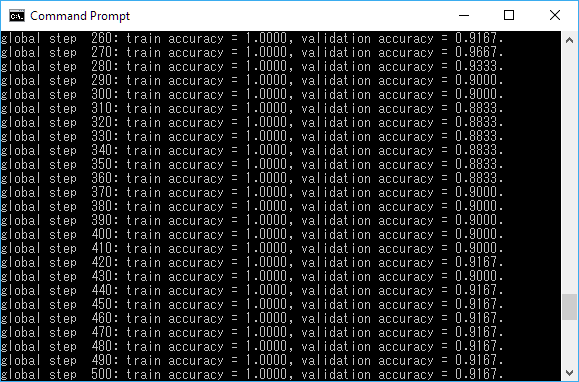
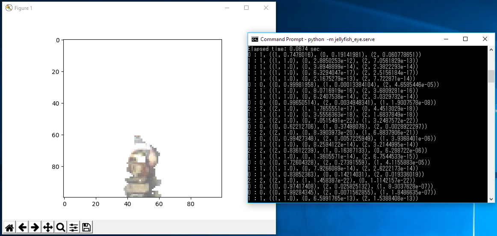

# プログラムの作成

このようにスゴイ深層学習を、実際のプログラムで試してみたくなりませんか？　私は試してみたくなっちゃったので、今回は、ロボットに一般物体認識させるプログラムを作ってきました。

で、その作ってきたソース・コードは、皆様が深層学習するときのテンプレートとして使用できるんじゃないかなーと考えてています。本章で紹介するソース・コードを少し修正するだけで、皆様が深層学習でやりたいことを実現できるんじゃないかなーと。

## ソース・コードの取得方法

そんなことを言われても、現物を見なければ信用できない？　おっしゃる通りですね。ソース・コードは[GitHub](https://github.com/tail-island/jellyfish-eye/)で管理していますので、[Git for Windows](https://git-for-windows.github.io/)をセットアップして、以下のコマンドでダウンロードしてみてください。

```bash
> cd TensorFlow  # 「2. インストール」で作成した、TensorFlow用の仮想環境
> git clone https://github.com/tail-island/jellyfish-eye.git
```

なお、プロジェクト名のjellyfish-eyeは、一部のクラゲは高機能な目を持っていて、脳がないにもかかわらず目で見た情報を処理して活用しているらしいことに由来しています。脳を持たないロボットがセンサーの情報にもとづいて自律行動しちゃうぜって感じですね。

## Pythonのパッケージ

Pythonでは、ファイルがパッケージの単位になります。`./aaa.py`の中から`./bbb.py`に含まれる関数を使う際には、`import bbb`してあげなければならないわけですね。

今回は、コードを活用しやすくするために、複数のファイルに分割しました。その際に、管理が楽になるように専用のパッケージを作成しています。`./xxx/ccc.py`のようにプログラム・ファイルをディレクトリの下に配置して、`import xxx.ccc`にしたわけですな。

このパッケージ名（ディレクトリ名）は、Pythonの文法に合うようにプロジェクト名の`-`を`_`に置換して、`jellyfish_eye`としました。

```bash
> mkdir jellyfish_eye
```

## データ

私の手持ちのロボットはTurtleBotというロボットで、これには深度センサー（MicrosoftのKinectのような、ドット単位で、センサーから物体までの距離を計測できるもの）が付いています。

＊＊＊絵＊＊＊

この深度センサーのデータを深層学習で処理して、ロボットの前に置かれたものが何かを回答することにしましょう（本稿では紹介しませんけど、実は、指定した物体の前まで移動するロボット用のプログラムも書いています。ロボットがモノを見分けるように見えて少し不気味なデモをご覧になりたい場合は、声をかけてください）。

ロボットの回答のレベルについても、考えなければなりません。というのも、「ギター」と回答するのか「平沢唯のギー太」と回答するのかで、難しさが変わってくるんですよ。「平沢唯のギー太」で学習して「平沢唯のギー太」を見つけるのは特定物体認識と呼ばれる技術で、実はかなり簡単で面白くない。だから、「平沢唯のギー太」で学習して、学習データには含まれていなかった「中野梓のフェンダーJAPANのムスタング」でも「ギター」と答えてくれる、とても難しい一般物体認識をやることにしましょう。

以上で方針が決まりましたので、学習用のデータを作成します。ロボットの上でプログラムを動かして、縦100ドット×横100ドット×(3原色＋距離)のデータを、「カレンダー」と「飲み物」、「ティッシュ・ペーパー」の3種類分、集めてきました（会社の机の周りにあった、適当なモノを3種類です）。

データを格納しているディレクトリーの構造は、以下の通り。

```
data
├── calendar
│   ├── DISNEY_カレンダー
│   ├── UNITED_BEES_カレンダー
│   └── software_AG_カレンダー
├── drink
│   ├── GEORGIA_EUROPIAN_香るブラック_400ml
│   ├── KIRIN_真っ赤なベリーのビタミーナ
│   ├── NATIONAL_VENDING_ホット
│   ├── POKKA_SAPPORO_冴えるBLACK_275g
│   ├── POKKA_SAPPORO_冴えるBLACK_400g
│   ├── POKKA_SAPPORO_富士山麓の天然水
│   └── SUNTORY_伊右衛門_1l
└── tissue-paper
    ├── FamilyMart_フェイシャルティシュー
    ├── Kleenex_HIGH_QUALITY_FACIAL_TISSUES
    ├── Kleenex_ハイクオリティ_フェイシャルティシュー
    ├── Kleenex_ローションティシュー_エックス
    └── エリエール_贅沢保湿
```

三階層目のディレクトリーの中に、それぞれの物体のデータが入ります。様々な角度からの、1物体につき複数のデータとなっています。

データの単位で、ファイルは分割されています（ファイルの拡張子は.txt）。そのファイルの1行は1ドットを表していて「赤<空白>緑＜空白＞青＜空白＞距離」となっています（それぞれのデータの範囲は、0.0〜1.0）。最初の行は左上のドット、次の行はその右のドットと続き、一番右になったら次の行の一番左に移動して、で、最も右下のドットに至るまで、10000行続いています。

## jellyfish\_eye/data\_sets.py

今回は独自のデータを使用していますから、前章のMNISTの場合のような便利データ管理クラスはありません。ですから、データ管理のコードを作成しました。

```python
import numpy as np
import os

from functools import partial
from itertools import chain, islice, repeat, starmap, tee


# データ管理用のクラスです。
class DataSet:
    # データをシャッフルします。
    def _shuffle(self):
        indice = np.arange(len(self.inputs))
        np.random.shuffle(indice)

        self.inputs = self.inputs[indice]
        self.labels = self.labels[indice]

    # コンストラクタ。inputs_collectionは、[[クラス0のデータ, クラス0のデータ...], [クラス1のデータ, クラス1のデータ], ...]としてください。
    def __init__(self, inputs_collection):
        self.inputs = np.array(tuple(chain.from_iterable(inputs_collection)))
        self.labels = np.array(tuple(chain.from_iterable(starmap(lambda i, inputs: repeat(i, len(inputs)), enumerate(inputs_collection)))))

        self._shuffle()
        self._batch_index = 0

    # バッチ学習用のデータを取得します。
    def next_batch(self, batch_size):
        if self._batch_index + batch_size > len(self.inputs):
            self._shuffle()
            self._batch_index = 0

        start = self._batch_index
        end = self._batch_index = self._batch_index + batch_size

        return self.inputs[start:end], self.labels[start:end]


# データを読み込みます。
def load(data_path='./data'):
    # データを1行分、読み込みます。
    def rgbz(line_string):
        # 赤と緑と青と距離に分割し、数値化します。
        return map(float, line_string.split())
    
    # データを1つ、読み込みます。
    def load_image(path):
        # 一行ずつ読み込んで、chain.from_iterableでフラットにします。
        with open(path) as file:
            return tuple(chain.from_iterable(map(rgbz, file)))
    
    # 物体のデータを読み込みます。
    def load_object(object_path):
        # 様々な角度からのデータを読み込みます。
        return map(load_image, filter(lambda path: '.txt' in path, map(partial(os.path.join, object_path), sorted(os.listdir(object_path)))))
        
    # クラス（カレンダーや飲み物）を読み込みます。
    def load_class(class_path):
        # 物体単位でデータを読み込んで、chain.from_iterableでフラットにします。
        return tuple(chain.from_iterable(map(load_object, map(partial(os.path.join, class_path), sorted(os.listdir(class_path))))))

    # 訓練データと検証データ、テスト・データに分割します。
    def train_validation_and_test(images):
        # 20番目以降を訓練データ、それより前を検証データとします。
        return images[20:], images[:20], images[:20]  # データ数が少ないので、検証データとテスト・データは同じにします。

    # クラス（カレンダーや飲み物）単位でデータを読み込んで、訓練データとテスト・データに分割し、データ・セットのクラスを生成します。
    return map(DataSet, zip(*map(train_validation_and_test, map(load_class, map(partial(os.path.join, data_path), sorted(os.listdir(data_path)))))))
```

上半分の`class DataSet`は、深層学習を使う目的がクラス分類ならば、どのようなデータでも使えると思います。お好きにコピー＆ペーストしてみてください。`_shuffle()`等でNumPyの面白機能を使っていて、NumPyの奥深さを味わえますな。

下半分の`load()`は、皆様のプロジェクトでは対象データが異なりますから、書き直しになるでしょう。その書き直しの負荷を減らすにはソース・コードの量を減らすのが有効で、そのためには関数型プログラミングが効く。だから、Pythonの公式文書の[関数型プログラミング HOWTO](https://docs/python.jp/3/howto/functional.html)を読んで、関数型で書いてみました。[関数型プログラミング HOWTO](https://docs/python.jp/3/howto/functional.html)は非常にわかりやすいので、一読するだけで、上のコードのような感じに関数型プログラミングでコード量を削減できますよ。あと、今回は採取できたデータ量が少なかったので、検証用とテスト用を同じデータ・セットとしました。

## jellyfish\_eye/model.py

次は、ニューラル・ネットワークを定義することにしましょう。以下がそのコード。

```python
import tensorflow as tf

from jellyfish_eye.utilities import summary_image, summary_image_collection, summary_scalar

# 必要なplaceholderを定義します。
inputs = tf.placeholder(tf.float32, (None, 100 * 100 * 4))
labels = tf.placeholder(tf.int32, (None,))
is_training = tf.placeholder_with_default(False, ())


# TensorFlowのドキュメントに、ニューラル・ネットワークを作成する関数名はinference（推論）にしろと書いてありました。なのでinference()。
def inference():
    # summary_image()とsummary_image_collection()は、次の項で説明します。ログを取ると思ってください。

    # 畳み込みできるように、データの形を変更します。
    outputs = summary_image('input', tf.reshape(inputs, (-1, 100, 100, 4)))
    
    # 畳み込みとプーリング（1層目）
    outputs = summary_image_collection('convolution-1', tf.contrib.layers.max_pool2d(tf.contrib.layers.conv2d(outputs, 32, 10), 2))
    
    # 畳み込みとプーリング（2層目）
    outputs = summary_image_collection('convolution-2', tf.contrib.layers.max_pool2d(tf.contrib.layers.conv2d(outputs, 64, 10), 2))
    
    # 全結合層で処理できるように、データの形を変更します。
    outputs = tf.contrib.layers.flatten(outputs)
    
    # 全結合層。1024ニューロンと512ニューロンの2層。
    outputs = tf.contrib.layers.stack(outputs, tf.contrib.layers.fully_connected, (1024, 512))
    
    # ドロップアウト。
    outputs = tf.contrib.layers.dropout(outputs, is_training=is_training)

    # 3クラスに分類します。
    return tf.contrib.layers.linear(outputs, 3)


# 損失関数。
def loss(logits):
    # summary_scalarは、次の項で説明します。ログを取るんだと思ってください。
    
    # クロス・エントロピーで、損失を計算します。
    return summary_scalar('loss', tf.reduce_mean(tf.nn.sparse_softmax_cross_entropy_with_logits(logits=logits, labels=labels)))


# 訓練。
def train(loss):
    # 学習率の設定が不要なAdamOptimizerを使用して訓練します。
    return tf.train.AdamOptimizer().minimize(loss)


# 精度。
def accuracy(logits):
    return tf.reduce_mean(tf.cast(tf.nn.in_top_k(logits, labels, 1), tf.float32))
```

前章でやった畳み込みニューラル・ネットワークのコードから、ニューラル・ネットに関係する部分を抜き出して、関数化しただけです。

で、これらの処理をわざわざ別のパッケージに抜き出した理由は、ソース・コードの変更を局所化するためです。深層学習してみたけど精度が低いという場合は、ニューラル・ネットワークをチューニングしなければなりません。で、チューニングでは何をするかというと、`max_pool2d()`や`conv2d()`、`fully_connected()`の引数を変更することになります。畳み込みで出力されるチャンネル数を増やしたりとか、減らしたりとか。あとは、畳込み層を増やすなんてのも、よくやります。これらのチューニング作業が、この`model.py`の修正だけで済むというわけ。

## jellyfish\_eye/utilities.py

さて、TensorFlowはとても良くできているのですけど、でも、痒いところ全てに手が届くような環境ではありません。あと、Python流のやり方の中には、[関数型プログラミング HOWTO](https://docs/python.jp/3/howto/functional.html)を熟読しちゃって関数型に慣れた後だと気持ち悪く感じるものもあります。

というわけで、ユーティリティーをいくつか作ってきました。

```python
import tensorflow as tf


# 画像をTensorBoardで確認できるようにするために、サマリーに追加します。
def summary_image(name, variable):
    # 一つ目の画像だけを抜き出して、サマリーに追加します。
    tf.summary.image(name, tf.slice(variable, (0, 0, 0, 0), (1, -1, -1, -1)))

    # 呼び出し時に一時変数を作らなくて済むようにするために、variableをリターンしておきます。関数型だと、一時変数は気持ち悪い。
    return variable


# 畳み込み後のような複数のチャンネルに別れた画像を、タイル状に並べてサマリーに追加します。
def summary_image_collection(name, variable):
    # 画像の高さ、幅、タイル状に並べる際の行と幅を取得します。
    h = tf.shape(variable)[1]
    w = tf.shape(variable)[2]
    r = tf.shape(variable)[3] // 8  # 畳込みの出力チャンネル数は、8の倍数にしてください……。
    c = 8

    # 一つ目の画像を、チャンネル単位にタイル状に並べます。
    image = tf.slice(variable, (0, 0, 0, 0), (1, -1, -1, -1))
    image = tf.reshape(image, (h, w, r, c))
    image = tf.transpose(image, (2, 0, 3, 1))
    image = tf.image.adjust_contrast(image, 1)
    image = tf.reshape(image, (1, r * h, c * w, 1))

    # サマリーに追加します。
    tf.summary.image(name, image)

    # 呼び出し時に一時変数を作らなくて済むようにするために、variableをリターンしておきます。
    return variable


# スカラー（1.0や'abc'などの、単一の値）を、サマリーに追加します。
def summary_scalar(name, variable):
    # サマリーに追加します。
    tf.summary.scalar(name, variable)

    # 呼び出し時に一時変数を作らなくて済むようにするために、variableをリターンしておきます。
    return variable
```

……えっと、サマリー関連だけですな。ユーティリティーが少ないのは、私が手を抜いたからではなく、TensorFlowの完成度が高いためだと考えてください。

さて、`summary_image()`や`summary_image_collection()`すると、TensorFlowの可視化ツールであるTensorBoardを通じて、深層学習がどのように働くのかを以下のような形で見る事ができます。

しているので、入力データを可視化できました。")

しているので、畳み込みの結果を可視化できました。タイル状に並んだ画像がいい感じに異なっていれば、学習が進んだと判断できます。")

前項のコードのように損失関数を`summary_scalar()`しておけば、値がどのように変化したのかが、以下のようにグラフで見ることができます。

しているので、損失関数の値の変化を可視化できました。0に近づいているので、学習は進んでいると考えられます。")

## jellyfish\_eye/train.py

以上で道具が揃いましたから、深層学習させるコードを書きましょう。

```python
import jellyfish_eye.data_sets as data_sets
import jellyfish_eye.model as model
import tensorflow as tf


# 学習用データを取得します。
train_data_set, validation_data_set, _ = data_sets.load()

# モデルで定義したplaceholderを取得します。
inputs = model.inputs
labels = model.labels
is_training = model.is_training

# ニューラル・ネットワークを定義します。
logits = model.inference()
train = model.train(model.loss(logits))
accuracy = model.accuracy(logits)

# 学習に必要な環境を整えます。
global_step = tf.contrib.framework.get_or_create_global_step()  # 何ステップ目の学習なのかを表現します。
inc_global_step = tf.assign(global_step, tf.add(global_step, 1))  # global_stepに1を足してインクリメントします。
summary = tf.summary.merge_all()  # TensorBoardへの出力をまとめます。
supervisor = tf.train.Supervisor(logdir='logs', save_model_secs=60, save_summaries_secs=60, summary_op=None)  # 学習全体を管理します。

# Supervisor経由で、セッションを取得します。
with supervisor.managed_session() as session:
    # Supervisorが問題を検出しなければ、学習を繰り返します。
    while True:  # not supervisor.should_stop():が正しいはずなのですけど、なぜかWindows環境では動かなかった……。
        # グローバル・ステップの値を取得します。
        global_step_value = session.run(global_step)

        # バッチ学習で、ニューラル・ネットワークを訓練します。
        train_inputs, train_labels = train_data_set.next_batch(20)
        session.run(train, feed_dict={inputs: train_inputs, labels: train_labels, is_training: True})

        # 一定のタイミングで、サマリーを取得したり、精度を出力したりします。
        if global_step_value % 10 == 0:
            # サマリーを取得します。
            supervisor.summary_computed(session, session.run(summary, feed_dict={inputs: train_inputs, labels: train_labels, is_training: True}))

            # 精度を出力します。
            print('global step {0:>4d}: train accuracy = {1:.4f}, validatio accuracy = {2:.4f}.'.format(
                global_step_value,
                session.run(accuracy, feed_dict={inputs: train_inputs, labels: train_labels}),
                session.run(accuracy, feed_dict={inputs: validation_data_set.inputs, labels: validation_data_set.labels})))

        # グローバル・ステップをインクリメントします。
        session.run(inc_global_step)
```

学習する「だけ」なら、前章のコードのような簡単なものでも良いのですけど、学習して精度を表示して終わりで後には何も残らないんじゃ、やる意味がないですよね？　そう、学習した結果を活用する、サービスを作らないと。あと、学習の途中でコンピューターが落ちたら最初からやり直しではキツイので、途中から学習を再開できる仕組みも必要です。学習が良い感じに進んでいるかどうか、目で見て確認もしたいですよね。

というわけで、`tf.train.Supervisor`を使いましょう。`Supervisor`を使うと、学習したモデルを`save_model_secs`で指定したタイミングで保存してくれます。そして、`Supervisor`経由でセッションを取得すれば、最新の学習結果（`logs/checkpoint`というファイルの中で指定すれば、最新でなくても可）で初期化されたモデルが手に入ります。これなら、保存された学習結果を活用するサービスを作れますし、学習の途中で中断して、その後に再開することもできます。サマリーも`save_summaries_secs`で指定した間隔で保存してくれますから、前述したモデルの中でサマリーに追加した様々な情報を可視化できます。

この`Supervisor`を使うには`global_step`の作成が必要だったり、`global_step`をインクリメントする処理が必要だったり、`summary_op=None`しておかないと`feed_dict`が必要なサマリーは使えなかったりと、少し面倒なところはあります。でも、その面倒は、上のコードをコピー＆ペーストすればゼロになって利点だけを手に入れられます。対象データやニューラル・ネットワークの内容が異なっても訓練のやり方は変わりませんから、上のコードの`import`する名前空間を変更するだけで、皆様のプロジェクトでも使えると思いますよ。

##jellyfish\_eye/serve.py

ついでですから、サービス化の前準備もしてしまいましょう。深層学習した結果を活用して、物体が何なのかを判断する関数を作成します。

```python
import jellyfish_eye.model as model
import numpy as np
import tensorflow as tf


# モデルで定義したplaceholderを取得します。
inputs = model.inputs

# ニューラル・ネットワークを定義します。確率で表現したいので、tf.nn.softmaxをtf.nn.top_kとinferenceの間に入れます。
top_k = tf.nn.top_k(tf.nn.softmax(model.inference()), k=3)

# サービスに必要な環境を整えます。
supervisor = tf.train.Supervisor(logdir='logs', save_model_secs=0, save_summaries_secs=0)
session = supervisor.PrepareSession()  # セッションを使いまわしたいので、managed_sessionではなくてPrepareSession()。なんで大文字なんだろ？


# クラスを判断します。
def classify(input):
    return session.run(top_k, feed_dict={inputs: np.array((input,))})


# ダミーの実行モジュール。削除しても構いません。
if __name__ == '__main__':
    import jellyfish_eye.data_sets as data_sets
    import matplotlib.pyplot as plot
    import time

    _, _, test_data_set = data_sets.load()
    classes = []

    starting_time = time.time()
    for input in test_data_set.inputs:
        classes.append(classify(input))
    finishing_time = time.time()
        
    print('Elapsed time: {0:.4f} sec'.format((finishing_time - starting_time) / len(test_data_set.inputs)))

    for input, label, class_ in zip(test_data_set.inputs, test_data_set.labels, classes):
        print('{0} : {1}, {2}'.format(label, class_.indices[0][0], tuple(zip(class_.indices[0], class_.values[0]))))
        
        plot.imshow(np.reshape(input, (100, 100, 4)))
        plot.show()
```

前項で紹介した`Supervisor`を使えば、サービスの提供も簡単に実現できます。セッション取得のための時間を節約するために、managed_session()ではなくPrepareSession()するところに注意するだけ。あとは、1件だけのデータをバッチ学習用のニューラル・ネットワークに通すために、`input`から`inputs`に形を変換する程度。まぁ、細かいことは考えずに上のコードの上半分をコピー＆ペーストすれば、ほとんどのプロジェクトで使えると思いますよ。

このコードは、以下のようにして他のパッケージから利用されることを想定しています。

```python
import jellyfish_eye.serve

...

image = ...  # 深度センサーからデータを取得。

if jellyfish_eye.serve.classify(image).indices[0][0] == 1:  # ディレクトリの名前順でクラスを決めたので、0がcalendarで1がdrink、2がtissue-paper。
  # 飲み物が目の前に置かれたので、飲み干す等の処理を実行する。
```

利用する側のコードは皆様が作るサービスの内容によって大きく異なるでしょうから、ごめんなさい、皆様が作ってください。私は、ロボットが指定した物体の前で手をロボット・アームを振るコードを作りました（物体をつかめるような高級なロボット・アームを持っていなかったため……）。

## 実行

以上で、全てのコードが完成しました。さっそく実行してみましょう。Pythonでパッケージ名を指定して実行するときは`python -m <パッケージ名>`とします。今回のコードの場合、訓練したいなら`python -m jellyfish_eye.train`、サービスを提供するなら`python -m jellyfish_eye.serve`となります。

さて、注目の深層学習の結果は……



うん、精度が80%を超えました！　`Ctrl-c`でプログラムを終了してください（`Supervisor`のおかげで途中で止めても再開できますから、ご安心ください）。データが少ないことを考慮すれば、かなり良いんじゃないでしょうか？

なお、GPUを積んでいない私の4年前のおんぼろラップトップPCだとここまで訓練するのに1*時間*くらいかかりましたが、NvidiaのGeForce GTX 980 Tiという1年前に10万円で買ったGPUを積んだPCで実験してみたら、1*分*で終わっちゃいました……。2017年3月現在なら980より圧倒的に速いというGeForce GTX 1080が8万円くらいで買えますので、もし深層学習に興味を持ったならGPUの購入をおすすめします。

あと、学習している間が暇だなーと感じるようでしたら、TensorFlowのツールであるTensorBoardで学習内容を可視化してみてください。TensorBoardは、コマンドラインから`tesnsorboard --logdir=logs`と入力すれば起動できます。コマンドライン上でTensorBoardが起動したら、Webブラウザを開いてURLに`localhost:6006`と入れればオッケー。こうすると、前の項で見ていただいたような畳込み結果や入力画像を見られたり、損失関数がどんどん減っている（学習がどんどん進んでいる）ことが分かるので、あまり退屈しないで済みます。

さて、訓練が終わったので、その結果をサービス化してみると……



うん、正しく判別できていますね。深層学習の「学習」には時間がかかりますけど、深層学習した結果を実行するだけなら、GPUなしでもかなり速いです。一回の判断に0.067秒しかかかっていないんですからね。これなら、私のロボットに積んでいるRaspberry Piでも、なんとか実行できそうですな。
